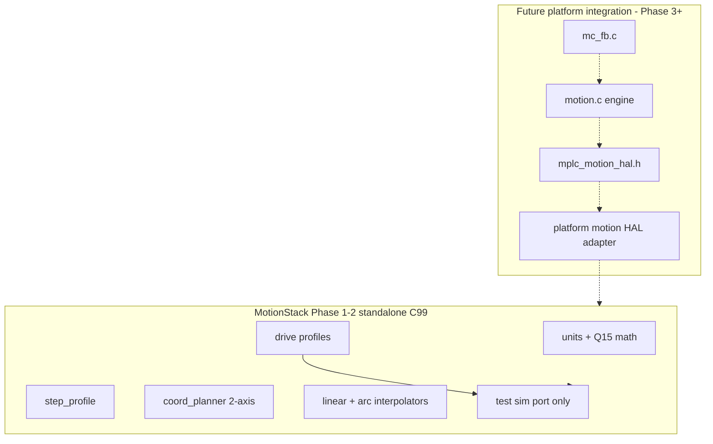

# MotionStack Architecture

## Overview

MotionStack separates portable motion math from platform pulse generation. The planner and interpolators operate in the step domain at a fixed tick rate (default **5000 Hz**, matching ClearCore `SysTiming.h`).



## Tick model

1. Application queues linear or arc segments (`mplc_motionstack_queue_*`).
2. Optional deferred start batches segments before motion begins.
3. `mplc_ms_planner_recalculate()` assigns junction-limited entry/exit speeds when GRBL mode is enabled.
4. Each tick, `mplc_motionstack_tick()` advances the active interpolator with accel-limited path speed.
5. Step deltas are emitted through `mplc_motionstack_port_t::emit_steps`.

## 2-axis coordination (Phase 2)

- Queue depth: 16 segments (`MPLC_MOTIONSTACK_QUEUE_DEPTH`).
- `mplc_ms_planner_recalculate()` — GRBL junction deviation, backward decel pass, forward accel pass (reference: ClearCore `RecalculatePlanner`).
- **Linear:** Q15 fractional interpolation with per-tick `sqrt(v_entry² + 2ad)` speed limits and endpoint snap.
- **Arc:** Parametric angle stepping with CW/CCW span, tangential accel limits, endpoint snap.

### Planner tuning knobs

| Setting | Default | API |
|---------|---------|-----|
| Junction deviation | `1` step | `mplc_ms_planner_set_junction_deviation()` |
| Junction Δv max | `0` (GRBL angle formula) | `mplc_ms_planner_set_junction_dv_max()` |
| Stop at queue tail | `true` | `mplc_ms_planner_set_stop_at_queue_end()` |
| GRBL planner | `true` | `mplc_ms_planner_set_grbl_mode()` |

## ClearPath golden path

The ClearPath drive profile (`drive_clearpath.c`) models:

- Step/direction mode with **1:1** pulse-to-position resolution
- HLFB asserted before coordinated motion when `require_hlfb_for_motion` is set
- Enable gating and fault/alert status fields (logic only — no SAM TC PWM)

Configure via `mplc_ms_drive_config_t` in `mplc_motionstack_config_t`.

## Platform port API

```c
typedef struct mplc_motionstack_port {
    void (*emit_steps)(uint8_t axis, int32_t delta, void *ctx);
    void (*set_direction)(uint8_t axis, bool negative, void *ctx);
    uint32_t (*max_steps_per_tick)(uint8_t axis, void *ctx);
    int32_t (*read_encoder_counts)(uint8_t axis, void *ctx);
} mplc_motionstack_port_t;
```

Phase 1–2 provide `MotionStack/test/port_sim.c` only — an in-memory step sink for unit tests. **No** NetBurner or firmware ports.

## Optional encoder feedback

`mplc_ms_encoder_state_t` tracks position and a per-tick velocity estimate. Encoder reads are optional via the port callback; closed-loop servo is out of scope.

## Future platform integration (Phase 3+)

When platform wiring begins, a thin adapter under `platforms/` will implement `mplc_motion_hal_*` and call MotionStack:

| `mplc_motion_hal_*` | MotionStack action |
|---------------------|-------------------|
| `init` / `shutdown` | `mplc_motionstack_init()` + register platform port |
| `enable` / `reset` | drive profile enable / fault clear |
| `start_absolute/velocity/home` | unit convert → enqueue segment |
| `stop` / `halt` | decel segment; axis lock |
| `get_status` | planner + drive + encoder → HAL status |
| `cycle(dt_us)` | advance planner; ISR emits steps via port |

Likely touch points (deferred):

- `runtime/CMakeLists.txt`
- `platforms/netburner/mod54415/nb_project/makefile`
- `docs/motion-hal.md`

Phase 3 creates the adapter files and links `mplc_motionstack` into platform/runtime builds.

## Endian wire format

Segment wire structs use LE fields via `mplc_ms_segment_wire_pack/unpack`. Host tests round-trip on LE; `test_ms_endian_be` validates LE byte order when compiled with `-DMPLC_BIG_ENDIAN`.
