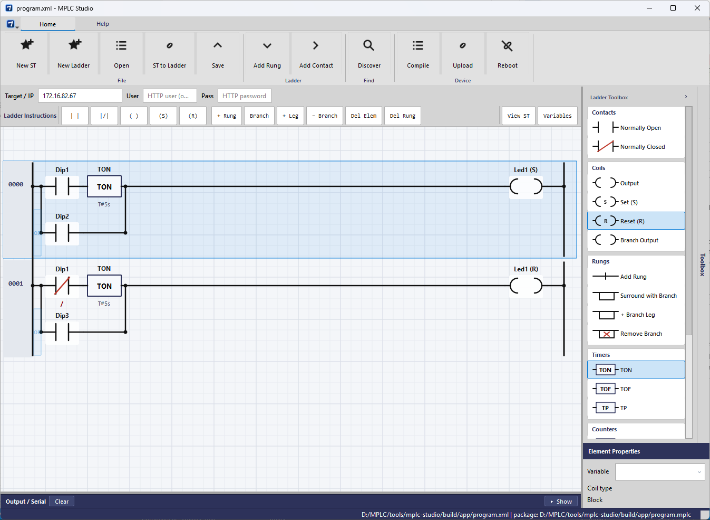

# MPLC Studio

Qt6 desktop IDE for editing Structured Text and Ladder Diagram projects, compiling in-process to `.mplc` packages, deploying to NetBurner MOD54415 targets, and monitoring the module debug UART.


## Features

### Editor

- Create, open, save, and save-as `.st` Structured Text files
- Create, open, save, and save-as `.xml` Ladder Diagram projects (PLCopen TC6 XML)
- Syntax highlighting for Structured Text
- **Ladder editor** (**early development**) — visual rung canvas with contacts, coils (normal/set/reset), parallel input/output branches, timers/counters, and standard function blocks (TON, TOF, TP, CTU, CTD, CTUD, R_TRIG, F_TRIG, SR, RS). Branch editing, layout, and compile coverage are still maturing; prefer ST for production programs until ladder stabilizes.



**Ladder implementation (brief):** The editor lives under `app/src/ladder/`. `LadderModel` holds rungs, elements, wire connections, and branch metadata (input OR regions with fork/join columns; output branch fork). `LadderBranchLogic` resolves nested branches and keeps join columns sized to the widest leg. `LadderScene` lays out a fixed column grid, draws power-rail wiring, and exposes selectable **OR** / **OUT** branch handles. `LadderPlcopenSerializer` reads/writes PLCopen XML; `LadderStExporter` produces ST for **View Generated ST**. Compile uses `compiler/frontend/ld/ld_parser.c` to lower ladder XML into the shared compiler IR—the same path as Structured Text to `.mplc`.

- **ST Instruction Toolbox** (right panel for ST) — searchable snippets for structure, variables, control flow, logic/math, and comments; click to insert at the cursor
- **Ladder Toolbox** (right panel for ladder) — add contacts, coils, rungs, parallel branches, and function blocks
- Variable table for ladder projects; validation messages below the canvas
- **View Generated ST** — inspect Structured Text exported from a ladder program (also used as compile fallback)
- Remembers last open file, toolbox expand/collapse, and window layout via `QSettings`

### Build and deploy

- **Compile** (`Ctrl+B`) — runs the embedded MPLC compiler (no external `mplc.exe`); writes `<source>.mplc` next to the source file (ladder `.xml` compiles through the LD frontend; ST export remains available via **View Generated ST**)
- Success and failure dialogs for compile, upload, and reboot
- **Discover** — UDP broadcast on the LAN; lists NetBurner devices and probes for MPLC HTTP upload support
- **Upload** — POST to `http://<device_ip>/mplc_upload.html` (multipart field `plcfile` → `mplc_startup.mplc` on device flash)
- **Reboot** — POST to `http://<device_ip>/mplc_reboot.html`
- Target IP, optional HTTP user/password in the connection row above the editor

### Output and serial

- **Output** tab — compile logs, upload/reboot status, discovery messages; **Clear** on the left (`Ctrl+L` from the app menu)
- **Serial Monitor** tab — COM port picker, baud rate (default 115200), DTR/RTS (on by default, like PuTTY), connect/disconnect, live RX log, send line with optional CR+LF
- Close PuTTY (or any other app) before connecting Studio to the same COM port

## Requirements

- Qt **6.8+** with **Widgets**, **Network**, and **SerialPort** (MSVC 2022 64-bit kit recommended)
- Visual Studio 2022 build tools
- CMake 3.21+
- NetBurner MOD54415 firmware built from [`platforms/netburner/mod54415/nb_project`](../../platforms/netburner/mod54415/nb_project) (HTTP upload + PLC runtime)

Install **Qt SerialPort** via Qt Maintenance Tool if the Serial Monitor tab shows an install hint instead of port controls.

## Build

```powershell
cd tools\mplc-studio
.\scripts\build-mplc-studio.ps1 -QtDir "C:\Qt\6.8.3\msvc2022_64"
```

The script configures Release, builds `MPLCStudio.exe`, and runs `windeployqt` so Qt DLLs sit next to the executable.

Output: `tools/mplc-studio/build/app/MPLCStudio.exe`

## Windows installer (Inno Setup)

Requires [Inno Setup 6](https://jrsoftware.org/isinfo.php). The installer script uses `app/resources/icons/win32ui.ico` for the setup wizard; Start Menu and desktop shortcuts use the icon embedded in `MPLCStudio.exe`.

```powershell
cd tools\mplc-studio
.\scripts\build-mplc-studio-installer.ps1 -QtDir "C:\Qt\6.8.3\msvc2022_64"
```

This builds Studio, stages the windeployqt output (exe, Qt DLLs, plugins), and runs `installer\MPLCStudio.iss`.

Output: `tools/mplc-studio/dist/MPLCStudio-0.1.1-Setup.exe`

Use `-SkipStudioBuild` to reuse an existing `build/app` tree, or `-AppVersion` to change the installer version label.

From the MPLC repo root:

```bat
cmake -S . -B build_studio -DMPLC_BUILD_COMPILER=ON -DMPLC_BUILD_STUDIO=ON -DCMAKE_PREFIX_PATH=C:\Qt\6.8.3\msvc2022_64
cmake --build build_studio --config Release --target mplc_studio
```

## Typical workflow

### Structured Text

1. Open or write ST in the editor (sample programs: [`platforms/netburner/mod54415/*.st`](../../platforms/netburner/mod54415/)).
2. Set **Target / IP** (and credentials if required).
3. **Compile** — confirm **Compile Complete**; package path is logged in the Output tab and status bar.
4. **Upload** — confirm **Upload Complete**.
5. **Reboot** — confirm **Reboot Requested**; watch **Serial Monitor** for boot text.

### Ladder Diagram

> **Early development.** The ladder canvas, branch UX, validator, and LD frontend are usable for experimentation but not yet at parity with the ST editor. Report issues and prefer `.st` for critical deployments.

1. Choose **New Ladder** (`Ctrl+Shift+N`) or open an existing `.xml` ladder project.
2. Edit rungs on the canvas; use the **Ladder Toolbox** to add contacts, coils, branches, and function blocks.
3. Declare variables in the table below the canvas (optional `%I` / `%Q` addresses).
4. **Compile**, **Upload**, and **Reboot** using the same device workflow as ST.
5. Use **View Generated ST** from the ladder toolbar or app menu to inspect exported Structured Text.

On successful file boot, serial output includes:

```text
MPLC: loaded package file 'mplc_startup.mplc'
```

Firmware reflash is only needed when the VM/runtime ABI changes—not for ST-only program updates.

## Keyboard shortcuts

| Action | Shortcut |
|--------|----------|
| New ST | `Ctrl+N` |
| New Ladder | `Ctrl+Shift+N` |
| Open | `Ctrl+O` |
| Save | `Ctrl+S` |
| Save As | `Ctrl+Shift+S` |
| Compile | `Ctrl+B` |
| Clear Output | `Ctrl+L` |
| Quit | `Ctrl+Q` |

## Related docs

- [NetBurner platform overview](../../platforms/netburner/README.md)
- [MOD54415 bring-up guide](../../docs/netburner-mod54415.md)
- [Architecture](../../docs/architecture.md)
- [Documentation index](../../docs/README.md)
